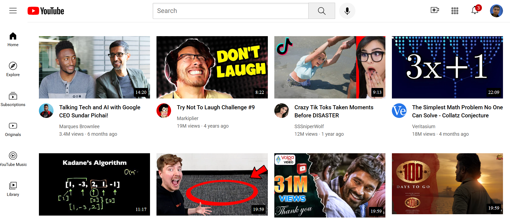

# YouTube Clone (Frontend)

A desktop-responsive frontend clone of YouTube built using HTML and CSS. This project focuses on replicating the core layout and design of the YouTube web interface, including the header, sidebar, and video content sections.

## 🚀 Features

- Responsive layout (optimized for desktop screens)
- Styled header with logo and search bar
- Vertical sidebar with navigation icons
- Grid-based video content section
- Clean and modern UI using pure HTML and CSS


## 📸 Screenshots



## 🛠️ Tech Stack

- HTML5
- CSS3

## 📌 Usage

1. Clone the repository:
   ```bash
   git clone https://github.com/sandeep-m-patil/Youtube-clone.git

   ```

